<div align="center">

# 🎙️ ODIA

### Voice-Guided, Real-Time Object Detection — Fully On Device

Speak or type what you want to find. ODIA listens, understands the object name,
and highlights matching objects in a live camera feed.

[](https://www.python.org/)
[](https://github.com/AILab-CVC/YOLO-World)
[](https://github.com/openai/whisper)
[](https://pytorch.org/)
[](#quick-start)

**[Quick Start](#quick-start) · [Pipeline](#pipeline) · [Models](#models-used) · [Tech Stack](#tech-stack) · [한국어](README-kr.md) · [Original README](README.md)**

</div>

---

## What is ODIA?

**ODIA** is an on-device AI application that connects Korean speech recognition
with open-vocabulary object detection. A request such as **“휴대폰과 사람을 찾아줘”**
(“Find a phone and a person”) is transcribed locally, mapped to supported object
classes, and applied to a real-time camera stream.

The result is displayed with bounding boxes, class labels, and confidence scores
through either a classic OpenCV window or an integrated PySide6 desktop app.

> This document is a concise, presentation-focused overview based on the more
> detailed [original README](README.md). See that document for benchmarks,
> implementation notes, current limitations, and the full Korean description.

## Why it matters

| Challenge | ODIA's approach |
| --- | --- |
| Finding items takes time | Ask for an object naturally and scan the scene live |
| Fixed-class detectors are inflexible | Switch YOLO-World classes while the app is running |
| Cloud speech APIs raise privacy and connectivity concerns | Run Whisper and vision inference locally |
| Speech inference can interrupt video | Separate the voice and vision workloads |
| Repeated class switching adds latency | Reuse cached COCO text embeddings |

## Key features

- 🎤 **Voice and text control** — accepts Korean voice commands or typed input.
- 👁️ **Open-vocabulary detection** — dynamically changes the active objects for
  YOLO-World instead of using one permanently fixed class list.
- 🔒 **Local-first inference** — core speech and vision processing runs without an
  external speech-to-text API.
- ⚡ **Fast class switching** — cached text embeddings reduce the measured average
  switch time from **2,083.23 ms to 47.54 ms** in the project benchmark.
- 🧵 **Responsive processing** — Whisper and camera inference run independently,
  connected by a latest-only class queue.
- 🖥️ **Two runtime experiences** — Classic OpenCV mode and a PySide6 desktop
  dashboard with live status, video, commands, and detections.
- 🧰 **Guided setup** — a Textual wizard validates audio, camera, models, theme,
  and runtime choices before launch.
- 🖼️ **Session stories** — the desktop app can save matching crops and optionally
  ask an authenticated Codex CLI to create a short Korean visual story.
- 🌐 **Distributed inference foundation** — coordinator and worker commands can
  route YOLO-World or Whisper jobs to capable nodes.
- 💻 **Hardware-aware execution** — prefers MPS or CUDA when available and supports
  CPU execution and fallback paths.

## Pipeline

### Mermaid

```mermaid
flowchart LR
    U([User]) -->|Korean speech| MIC[Microphone]
    U -->|Typed command| TXT[Text input]

    subgraph Voice[Voice pipeline]
        MIC --> AUDIO[SoundDevice stream]
        AUDIO --> VAD[RMS voice activity detection]
        VAD --> STT[Whisper STT]
    end

    STT --> PARSE[Object-name parser]
    TXT --> PARSE
    PARSE --> MAP[Korean-to-YOLO class mapping]
    MAP --> QUEUE[Latest-only class queue]

    subgraph Vision[Vision pipeline]
        CAM[Camera frame] --> YOLO[YOLO-World v2 Small]
        QUEUE --> CACHE[Cached text embedding switch]
        CACHE --> YOLO
        YOLO --> DET[Boxes · labels · confidence]
    end

    DET --> UI{Runtime}
    UI --> CLASSIC[Classic · OpenCV]
    UI --> DESKTOP[Desktop · PySide6]
    DESKTOP -. optional .-> STORY[Session crops + Codex story]

    classDef input fill:#172554,stroke:#60a5fa,color:#fff
    classDef model fill:#3b0764,stroke:#c084fc,color:#fff
    classDef output fill:#052e16,stroke:#4ade80,color:#fff
    class U,MIC,TXT,CAM input
    class STT,YOLO,STORY model
    class DET,CLASSIC,DESKTOP output
```



### ASCII

```text
                           ┌──────────────────────┐
 Korean speech ──► Mic ──►│ RMS VAD + Whisper   │──► Korean text ──┐
                           └──────────────────────┘                  │
                                                                    ▼
 Typed command ───────────────────────────────────────────► Object parser
                                                                    │
                                                                    ▼
                                                      Korean ↔ YOLO mapping
                                                                    │
                                                                    ▼
 Camera ──► frames ──► YOLO-World ◄── cached embeddings ◄── latest-only queue
                           │
                           ▼
              boxes + labels + confidence
                           │
                   ┌───────┴────────┐
                   ▼                ▼
             Classic UI       Desktop UI ──► optional session story
              (OpenCV)         (PySide6)       (Codex CLI)
```

The voice path and vision path run separately. The queue keeps only the newest
request, and the vision side applies class changes between frames so inference
does not race with model-state updates.

## Models used

| Model | Role | Configuration in this project |
| --- | --- | --- |
| **YOLO-World v2 Small** | Open-vocabulary object detection | `yolov8s-worldv2.pt`, ~12.76M parameters, 640 × 640 input, default confidence `0.65` |
| **OpenAI Whisper Base** | Korean speech-to-text | Recommended interactive preset; 16 kHz mono `float32` audio on CPU |
| **OpenAI Whisper Tiny** | Faster Korean speech-to-text | Optional interactive preset with a speed/accuracy trade-off |
| **CLIP text encoder** | Produces YOLO-World class embeddings | Ultralytics fork; pretrained COCO embeddings are cached for live switching |
| **Codex CLI** | Optional visual-story generation | Reads selected session crops and event metadata locally or through SSH |

Distributed workers can also advertise Whisper **Small**, **Medium**, and
**Large-v3** capabilities. These are worker capabilities, not choices currently
shown in the interactive device-setup model picker.

## Tech stack

| Layer | Technologies |
| --- | --- |
| Language and packaging | Python 3.11, uv, `pyproject.toml`, `uv.lock` |
| AI and inference | PyTorch 2.13, Torchvision 0.28, Ultralytics 8.4, YOLO-World, Whisper, CLIP |
| Vision | OpenCV 5, NumPy, `cv2-enumerate-cameras` |
| Audio | sounddevice, soundfile, RMS-based VAD |
| Interfaces | Textual TUI, PySide6 desktop GUI, OpenCV display |
| Concurrency | Python threads, Qt `QThread`, bounded queues |
| Distributed runtime | Versioned HTTP/JSON coordinator, client, scheduler, and workers |
| Quality | pytest-based test suite, Black development tooling |
| Bootstrap | Bash for macOS/Linux, PowerShell for Windows |

Exact dependency versions are defined in [`pyproject.toml`](pyproject.toml) and
locked in [`uv.lock`](uv.lock).

## Runtime options

| Mode | Best for | Experience |
| --- | --- | --- |
| **Classic** | Stability and a minimal runtime | Terminal status plus a native OpenCV video window |
| **Desktop** | A unified visual workflow | PySide6 dashboard with video, device status, voice/text commands, crop gallery, and stories |

Before either runtime starts, the Textual setup wizard walks through theme,
speaker, microphone, camera, vision model, and voice model validation.

## Quick start

### Requirements

- Python 3.11-compatible system
- Camera and microphone
- Camera and microphone permissions
- macOS, Linux, or Windows

### macOS / Linux

```bash
git clone https://github.com/wooseokkim1992-byte/detect_objects.git
cd detect_objects
./bootstrap/setup.sh
```

### Windows PowerShell

```powershell
git clone https://github.com/wooseokkim1992-byte/detect_objects.git
cd detect_objects
.\bootstrap\setup.ps1
```

The bootstrap flow prepares a project-local `.odia` environment, installs and
validates dependencies, downloads required model artifacts, and launches ODIA.
It does not modify the user's shell profile.

If the environment is already ready:

```bash
uv run odia
# or
uv run python -m detect_objects
```

## How to use

1. Complete the guided speaker, microphone, camera, and model checks.
2. Choose the **Classic** or **Desktop** runtime.
3. Say or type a command such as `휴대폰과 사람을 찾아줘`.
4. Point the camera at the scene and review the live detection overlays.
5. In Classic mode, press `q` to exit. In Desktop mode, use **Quit**.

## Project structure

```text
detect_objects/
├── bootstrap/                  # Environment setup and validation
├── config/models.toml          # YOLO weights, confidence, and image size
├── src/detect_objects/
│   ├── camera_cv/              # Classic camera and detection loop
│   ├── desktop/                # PySide6 desktop runtime
│   ├── device_setup/           # Audio and camera validation
│   ├── distributed/            # Coordinator, scheduler, clients, workers
│   ├── models/                 # Model catalog, loading, device selection, cache
│   ├── story/                  # Session recording and story generation
│   ├── tui/                    # Textual setup wizard
│   └── voice_text_convert/     # Whisper, VAD, parsing, class mapping
├── tests/                      # Automated tests by subsystem
├── docs/                       # Architecture, platform, and learning guides
├── pyproject.toml              # Package metadata and dependencies
└── uv.lock                     # Reproducible dependency lock
```

## Performance highlight

Embedding reuse is a central optimization. A normal `set_classes()` call may
tokenize text, run the CLIP encoder, move tensors between devices, and mutate
the detection head. ODIA instead extracts the checkpoint's COCO embeddings into
a CPU cache and activates only the tensors needed by the newest request.

```text
Average class switch — standard path : 2083.23 ms  ████████████████████
Average class switch — cached path   :   47.54 ms  ▌
```

That project measurement represents an approximately **43.8× faster** class
switch. Results depend on the machine, backend, and active class set.

## Current boundaries

- Detection is strongest for classes already represented in the project's
  dictionary and embedding cache.
- Commands involving attributes or relationships, such as “the person wearing
  a backpack,” have limited semantic support.
- Short Korean object names can be sensitive to pronunciation and noise.
- RMS VAD thresholds may need tuning for the microphone and environment.
- Larger models and higher-resolution input increase memory use and latency.
- Some YOLO-World operations can fall back from Apple MPS to CPU.

## Documentation

- 📘 [Original project README](README.md) — detailed Korean overview, benchmarks,
  optimization notes, limits, and references
- 🇰🇷 [Korean project overview](README-kr.md) — Korean edition of this document
- 🧭 [Documentation index](docs/index.md) — entry point for all project docs
- 🖥️ [Interface architecture](docs/project_interface.md) — bootstrap, setup,
  Classic, and Desktop interface layers
- 🎞️ [Session story prototype](docs/session-story-prototype.md) — story workflow
  and generated artifacts
- 🌐 [Distributed module commands](docs/distributed/python_module_commands.md) —
  coordinator and worker commands

## References

- [YOLO-World: Real-Time Open-Vocabulary Object Detection](https://openaccess.thecvf.com/content/CVPR2024/html/Cheng_YOLO-World_Real-Time_Open-Vocabulary_Object_Detection_CVPR_2024_paper.html)
- [Official YOLO-World implementation](https://github.com/AILab-CVC/YOLO-World)
- [Whisper: Robust Speech Recognition via Large-Scale Weak Supervision](https://arxiv.org/abs/2212.04356)
- [Official OpenAI Whisper implementation](https://github.com/openai/whisper)

---

<div align="center">

**ODIA turns a natural-language request into a live visual answer.**

On Device AI — First Project · 김현수 · 김우석

</div>
