<div align="center">

# 🎙️ ODIA

### 음성으로 제어하는 실시간 온디바이스 객체 탐지

찾고 싶은 물체를 말하거나 입력하세요. ODIA가 객체명을 이해하고
실시간 카메라 화면에서 일치하는 물체를 찾아 표시합니다.

[](https://www.python.org/)
[](https://github.com/AILab-CVC/YOLO-World)
[](https://github.com/openai/whisper)
[](https://pytorch.org/)
[](#빠른-시작)

**[빠른 시작](#빠른-시작) · [파이프라인](#파이프라인) · [사용 모델](#사용-모델) · [기술 스택](#기술-스택) · [영문 README](README-eng.md) · [기존 README](README.md)**

</div>

---

## ODIA란?

**ODIA**는 한국어 음성 인식과 Open-vocabulary 객체 탐지를 연결한 온디바이스
AI 애플리케이션입니다. **“휴대폰과 사람을 찾아줘”**와 같은 요청을 로컬에서
텍스트로 변환하고, 지원하는 객체 클래스에 매핑한 뒤 실시간 카메라 영상에
적용합니다.

탐지 결과는 Bounding Box, 클래스 이름, 신뢰도와 함께 Classic OpenCV 창 또는
통합 PySide6 데스크톱 앱에 표시됩니다.

> 이 문서는 프로젝트를 빠르게 파악할 수 있도록 구성한 시각 중심의 한국어
> 소개 자료입니다. 벤치마크, 구현 상세, 현재 한계와 전체 설명은
> [기존 README](README.md)에서 확인할 수 있습니다. 같은 구성의 영문판은
> [README-eng.md](README-eng.md)를 참고하세요.

## 해결하려는 문제

| 문제 | ODIA의 접근 방식 |
| --- | --- |
| 원하는 물건을 찾는 데 시간이 걸림 | 자연어로 물체를 요청하고 카메라로 주변을 실시간 탐색 |
| 고정 클래스 탐지기의 유연성 부족 | 실행 중 YOLO-World의 활성 클래스를 동적으로 변경 |
| 클라우드 음성 API의 개인정보 및 연결성 문제 | Whisper와 비전 추론을 로컬에서 실행 |
| 음성 추론 중 영상이 멈출 수 있음 | 음성과 비전 작업을 분리하여 병렬 처리 |
| 반복적인 클래스 변경으로 지연 발생 | 캐시한 COCO 텍스트 임베딩을 재사용 |

## 주요 기능

- 🎤 **음성 및 텍스트 제어** — 한국어 음성 명령과 키보드 입력을 모두 지원합니다.
- 👁️ **Open-vocabulary 탐지** — 하나의 고정된 클래스 목록 대신 실행 중
  YOLO-World의 탐지 대상을 동적으로 변경합니다.
- 🔒 **로컬 중심 추론** — 핵심 음성 및 비전 처리를 외부 STT API 없이
  로컬 장치에서 실행합니다.
- ⚡ **빠른 클래스 전환** — 텍스트 임베딩 캐시를 통해 프로젝트 측정 기준 평균
  전환 시간을 **2,083.23 ms에서 47.54 ms로 단축**했습니다.
- 🧵 **끊김 없는 처리** — Whisper와 카메라 추론을 독립적으로 실행하고
  최신 클래스 하나만 유지하는 Queue로 연결합니다.
- 🖥️ **두 가지 런타임** — Classic OpenCV 모드와 영상, 상태, 명령, 탐지 결과를
  통합한 PySide6 Desktop 대시보드를 제공합니다.
- 🧰 **단계별 설정** — Textual 마법사에서 오디오, 카메라, 모델, 테마와
  실행 모드를 확인한 뒤 애플리케이션을 시작합니다.
- 🖼️ **세션 스토리** — Desktop 앱에서 탐지 객체 Crop을 저장하고, 선택적으로
  인증된 Codex CLI를 통해 짧은 한국어 이야기를 만들 수 있습니다.
- 🌐 **분산 추론 기반** — Coordinator와 Worker 명령으로 YOLO-World 또는
  Whisper 작업을 처리 가능한 노드에 전달할 수 있습니다.
- 💻 **하드웨어 자동 선택** — 사용 가능한 경우 MPS 또는 CUDA를 우선 사용하고
  CPU 실행과 Fallback 경로를 지원합니다.

## 파이프라인

### Mermaid

```mermaid
flowchart LR
    U([사용자]) -->|한국어 음성| MIC[마이크]
    U -->|텍스트 명령| TXT[텍스트 입력]

    subgraph Voice[음성 파이프라인]
        MIC --> AUDIO[SoundDevice 스트림]
        AUDIO --> VAD[RMS 음성 구간 감지]
        VAD --> STT[Whisper 음성 인식]
    end

    STT --> PARSE[객체명 분석]
    TXT --> PARSE
    PARSE --> MAP[한국어-YOLO 클래스 매핑]
    MAP --> QUEUE[최신 클래스 Queue]

    subgraph Vision[비전 파이프라인]
        CAM[카메라 프레임] --> YOLO[YOLO-World v2 Small]
        QUEUE --> CACHE[캐시 임베딩 전환]
        CACHE --> YOLO
        YOLO --> DET[박스 · 클래스 · 신뢰도]
    end

    DET --> UI{런타임}
    UI --> CLASSIC[Classic · OpenCV]
    UI --> DESKTOP[Desktop · PySide6]
    DESKTOP -. 선택 기능 .-> STORY[세션 Crop + Codex 스토리]

    classDef input fill:#172554,stroke:#60a5fa,color:#fff
    classDef model fill:#3b0764,stroke:#c084fc,color:#fff
    classDef output fill:#052e16,stroke:#4ade80,color:#fff
    class U,MIC,TXT,CAM input
    class STT,YOLO,STORY model
    class DET,CLASSIC,DESKTOP output
```



### ASCII

```text
                         ┌────────────────────────┐
 한국어 음성 ─► 마이크 ─►│ RMS VAD + Whisper     │──► 인식된 문장 ─┐
                         └────────────────────────┘                  │
                                                                    ▼
 텍스트 명령 ──────────────────────────────────────────────► 객체명 분석
                                                                    │
                                                                    ▼
                                                       한국어 ↔ YOLO 매핑
                                                                    │
                                                                    ▼
 카메라 ─► 프레임 ─► YOLO-World ◄── 캐시 임베딩 ◄── 최신 클래스 Queue
                          │
                          ▼
                 박스 + 클래스 + 신뢰도
                          │
                  ┌───────┴────────┐
                  ▼                ▼
             Classic UI       Desktop UI ──► 선택적 세션 스토리
              (OpenCV)         (PySide6)       (Codex CLI)
```

음성과 비전 경로는 서로 분리되어 실행됩니다. Queue는 가장 최근 요청만 유지하며,
비전 실행부는 프레임 사이에 클래스를 변경하여 추론과 모델 상태 변경이 동시에
일어나지 않도록 합니다.

## 사용 모델

| 모델 | 역할 | 프로젝트 설정 |
| --- | --- | --- |
| **YOLO-World v2 Small** | Open-vocabulary 객체 탐지 | `yolov8s-worldv2.pt`, 약 12.76M Parameters, 640 × 640 입력, 기본 신뢰도 `0.65` |
| **OpenAI Whisper Base** | 한국어 음성 인식 | 권장 대화형 Preset, 16 kHz Mono `float32` 오디오, CPU 추론 |
| **OpenAI Whisper Tiny** | 빠른 한국어 음성 인식 | 속도를 높이고 정확도를 일부 절충한 선택형 Preset |
| **CLIP Text Encoder** | YOLO-World 클래스 임베딩 생성 | Ultralytics Fork, 실시간 전환을 위해 사전 학습된 COCO 임베딩 캐시 |
| **Codex CLI** | 선택적 Visual Story 생성 | 선택한 세션 Crop과 이벤트 정보를 로컬 또는 SSH 환경에서 처리 |

분산 Worker에서는 Whisper **Small**, **Medium**, **Large-v3** 기능도 제공할 수
있습니다. 이 모델들은 Worker용 기능이며, 현재 대화형 장치 설정 화면의 모델
선택 항목에는 표시되지 않습니다.

## 기술 스택

| 계층 | 기술 |
| --- | --- |
| 언어 및 패키지 관리 | Python 3.11, uv, `pyproject.toml`, `uv.lock` |
| AI 및 추론 | PyTorch 2.13, Torchvision 0.28, Ultralytics 8.4, YOLO-World, Whisper, CLIP |
| 비전 | OpenCV 5, NumPy, `cv2-enumerate-cameras` |
| 오디오 | sounddevice, soundfile, RMS 기반 VAD |
| 인터페이스 | Textual TUI, PySide6 Desktop GUI, OpenCV Display |
| 동시성 | Python Thread, Qt `QThread`, 크기가 제한된 Queue |
| 분산 런타임 | Versioned HTTP/JSON Coordinator, Client, Scheduler, Worker |
| 품질 관리 | pytest 기반 테스트 모음, Black 개발 도구 |
| Bootstrap | macOS/Linux용 Bash, Windows용 PowerShell |

정확한 Dependency 버전은 [`pyproject.toml`](pyproject.toml)에 정의되어 있으며
[`uv.lock`](uv.lock)에 고정되어 있습니다.

## 런타임 선택

| 모드 | 적합한 용도 | 사용자 경험 |
| --- | --- | --- |
| **Classic** | 안정성과 단순한 실행 환경 | 터미널 상태 정보와 별도의 OpenCV 영상 창 |
| **Desktop** | 하나로 통합된 시각적 작업 환경 | 영상, 장치 상태, 음성·텍스트 명령, Crop Gallery와 Story를 제공하는 PySide6 대시보드 |

두 런타임 모두 시작 전에 Textual 설정 마법사에서 테마, 스피커, 마이크, 카메라,
비전 모델과 음성 모델을 순서대로 점검합니다.

## 빠른 시작

### 요구 사항

- Python 3.11 호환 시스템
- 카메라와 마이크
- 카메라 및 마이크 접근 권한
- macOS, Linux 또는 Windows

### macOS / Linux

```bash
git clone https://github.com/wooseokkim1992-byte/detect_objects.git
cd detect_objects
./bootstrap/setup.sh
```

### Windows PowerShell

```powershell
git clone https://github.com/wooseokkim1992-byte/detect_objects.git
cd detect_objects
.\bootstrap\setup.ps1
```

Bootstrap은 프로젝트 내부의 `.odia` 환경을 준비하고, Dependency 설치 및 검증과
필요한 모델 Artifact 다운로드를 완료한 뒤 ODIA를 실행합니다. 사용자의 Shell
Profile은 변경하지 않습니다.

환경이 이미 준비되어 있다면 다음 명령으로 바로 실행할 수 있습니다.

```bash
uv run odia
# 또는
uv run python -m detect_objects
```

## 사용 방법

1. 안내에 따라 스피커, 마이크, 카메라와 모델 점검을 완료합니다.
2. **Classic** 또는 **Desktop** 런타임을 선택합니다.
3. `휴대폰과 사람을 찾아줘`와 같은 명령을 말하거나 입력합니다.
4. 카메라로 주변을 비추고 실시간 탐지 결과를 확인합니다.
5. Classic 모드에서는 `q`, Desktop 모드에서는 **Quit** 버튼으로 종료합니다.

## 프로젝트 구조

```text
detect_objects/
├── bootstrap/                  # 환경 설치 및 검증
├── config/models.toml          # YOLO Weight, 신뢰도, 입력 크기
├── src/detect_objects/
│   ├── camera_cv/              # Classic 카메라 및 탐지 Loop
│   ├── desktop/                # PySide6 Desktop 런타임
│   ├── device_setup/           # 오디오 및 카메라 검증
│   ├── distributed/            # Coordinator, Scheduler, Client, Worker
│   ├── models/                 # 모델 목록, 로딩, 장치 선택, Cache
│   ├── story/                  # 세션 기록 및 Story 생성
│   ├── tui/                    # Textual 설정 마법사
│   └── voice_text_convert/     # Whisper, VAD, Parsing, 클래스 Mapping
├── tests/                      # 하위 시스템별 자동 테스트
├── docs/                       # 아키텍처, 플랫폼, 학습 문서
├── pyproject.toml              # 패키지 Metadata 및 Dependency
└── uv.lock                     # 재현 가능한 Dependency Lock
```

## 성능 하이라이트

임베딩 재사용은 ODIA의 핵심 최적화입니다. 일반적인 `set_classes()` 호출은 텍스트
Tokenizing, CLIP Encoder 실행, 장치 간 Tensor 이동과 Detection Head 변경을
수행할 수 있습니다. ODIA는 대신 Checkpoint의 COCO 임베딩을 CPU Cache에 저장하고
가장 최근 요청에 필요한 Tensor만 활성화합니다.

```text
평균 클래스 전환 — 기존 방식 : 2083.23 ms  ████████████████████
평균 클래스 전환 — 캐시 방식 :   47.54 ms  ▌
```

프로젝트 측정 결과, 클래스 전환 속도가 약 **43.8배 향상**되었습니다. 실제 결과는
실행 장치, Backend와 활성 클래스 구성에 따라 달라질 수 있습니다.

## 현재 한계

- 프로젝트의 Dictionary와 Embedding Cache에 포함된 클래스에서 가장 안정적으로
  동작합니다.
- “백팩을 멘 사람”과 같이 속성이나 관계를 포함한 명령의 의미 해석은 제한적입니다.
- 짧은 한국어 객체명은 발음과 주변 소음의 영향을 받을 수 있습니다.
- RMS VAD Threshold는 마이크와 사용 환경에 맞게 조정해야 할 수 있습니다.
- 큰 모델과 고해상도 입력은 Memory 사용량과 Latency를 증가시킵니다.
- 일부 YOLO-World 연산은 Apple MPS에서 CPU로 Fallback될 수 있습니다.

## 문서

- 📘 [기존 프로젝트 README](README.md) — 상세 한국어 소개, 벤치마크,
  최적화 설명, 현재 한계와 참고 자료
- 🇬🇧 [영문 프로젝트 README](README-eng.md) — 같은 구성의 영문 소개
- 🧭 [문서 인덱스](docs/index.md) — 전체 프로젝트 문서의 시작점
- 🖥️ [인터페이스 아키텍처](docs/project_interface.md) — Bootstrap, 설정,
  Classic과 Desktop 인터페이스 계층
- 🎞️ [세션 스토리 프로토타입](docs/session-story-prototype.md) — Story 흐름과
  생성 Artifact
- 🌐 [분산 모듈 명령](docs/distributed/python_module_commands.md) — Coordinator와
  Worker 실행 명령

## 참고 자료

- [YOLO-World: Real-Time Open-Vocabulary Object Detection](https://openaccess.thecvf.com/content/CVPR2024/html/Cheng_YOLO-World_Real-Time_Open-Vocabulary_Object_Detection_CVPR_2024_paper.html)
- [YOLO-World 공식 구현](https://github.com/AILab-CVC/YOLO-World)
- [Whisper: Robust Speech Recognition via Large-Scale Weak Supervision](https://arxiv.org/abs/2212.04356)
- [OpenAI Whisper 공식 구현](https://github.com/openai/whisper)

---

<div align="center">

**ODIA는 자연어 요청을 실시간 시각 정보로 바꿉니다.**

On Device AI 1차 프로젝트 · 김현수 · 김우석

</div>
